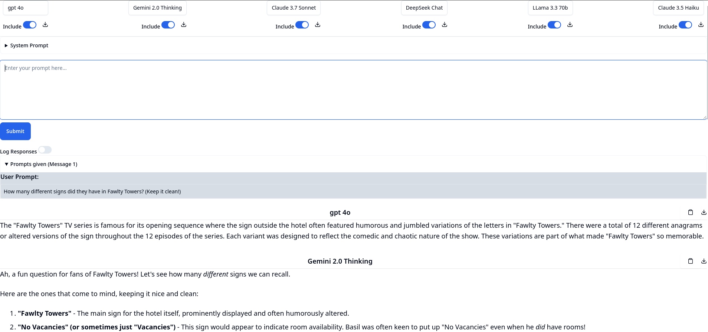

# councillm

Query multiple LLMs simultaneously with the same prompts.

councillm is a FastHTML application that lets you pose the same question to several different Large Language Models at once, allowing you to easily see how different models respond to identical prompts.

It optionally can log the responses to a local SQLite database (due to using Simon Willison's excellent [llm](https://github.com/simonw/llm) package), so that you can search them later.

## What does it do?

- Send a single prompt to multiple LLMs simultaneously
- Shows you all responses headed by the LLM model name for easy comparison
- Allows you to Include (or Exclude) each model each time you prompt
- Adds newer responses above older ones
- Allows you to copy a response as rich text, or download as markdown text
- Allows you to download a conversation with any of those LLMs as markdown text

There is also a marimo notebook that you can run locally to have logged chats with individual LLMs, or to search the data logged to the database.

## Screenshots

### The Council:


### Marimo Notebook:


## Quick start

First you need to install uv - see https://docs.astral.sh/uv/getting-started/installation/ - note too that you would need to close whatever shell or terminal you first installed uv from.

Assuming you are starting in the folder where you downloaded councillm, you can start the app this way:
```bash
. ./start_app.sh
```
(Or if on Windows, `start_app.bat`)

When the app starts you will notice it usually says it has started against an IP and a port - e.g. http://0.0.0.0:5001

If 5001 is the port it is using, visit http://localhost:5001 in your browser.

Both start_app scripts allow you to input some options if you want to adjust these defaults:
```
  -n 7                  # set the number of models to query (e.g. here is for 7 models)
  --no-logging          # start with logging toggled off
```


If you want to start the marimo notebook:
```bash
. ./start_mo.sh
```
(Or if on Windows, `start_mo.bat`)

Marimo will also start a browser window with the notebook open.


## Configure your models

councillm needs API keys for the models you want to query.

EITHER set them as environment variables, like so in bash:
```bash
export OPENAI_API_KEY=sk-...
export ANTHROPIC_API_KEY=sk-...
export GEMINI_API_KEY=...
export GROQ_API_KEY=...
export DEEPSEEK_API_KEY=...
```


OR set them via the `llm` command line:
`uvx llm keys set openai`
(when prompted, enter your OpenAI API key)
`uvx llm keys set anthropic`
(similar, but for Anthropic)
... and so on

## Development

This project was built with [nbdev](https://nbdev.fast.ai/). To contribute, please remember to set up your local git using `nbdev_install_hooks` and to edit the code in the notebook rather than the code in the councillm folder.

## License

Apache2


